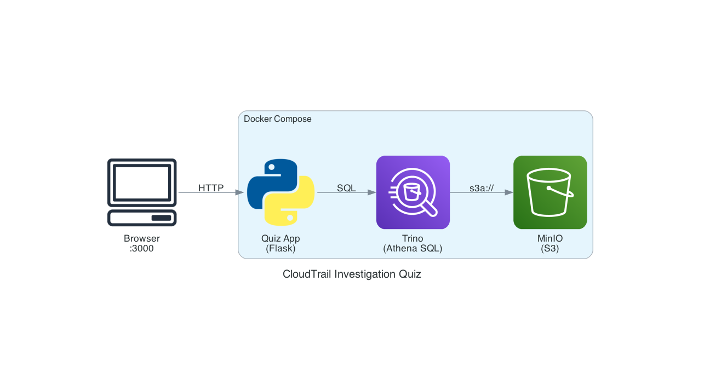

# CloudTrail 調査クイズ

[](https://codespaces.new/Nat-bee/athena-quiz)

Athena SQL で CloudTrail ログを調査する練習環境。

攻撃シミュレーション ([invictus-ir/aws_dataset](https://github.com/invictus-ir/aws_dataset)) の 2,900 件の CloudTrail イベントに対して SQL クエリを実行し、権限昇格・証拠隠滅・永続化などの攻撃痕跡を特定する。

## 起動

```bash
make up
# http://localhost:3000 を開く
```

## Codespaces

上のバッジをクリックするだけで起動する。

## テーブル

`cloudtrail_logs` — 主要カラム:

| カラム | 内容 |
|--------|------|
| eventtime | タイムスタンプ |
| eventsource | AWS サービス |
| eventname | API アクション |
| useridentity | 呼び出し元 (JSON) |
| requestparameters | リクエスト内容 (JSON) |
| errorcode | エラーコード |

JSON カラムは `JSON_EXTRACT_SCALAR(useridentity, '$.userName')` でアクセスする。

## アーキテクチャ


